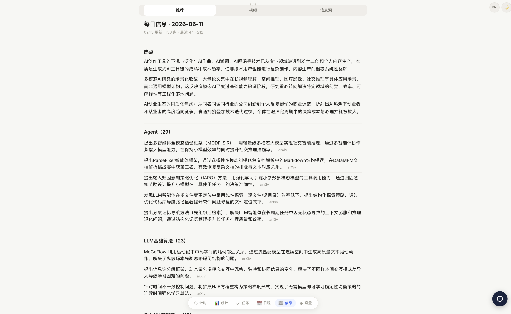
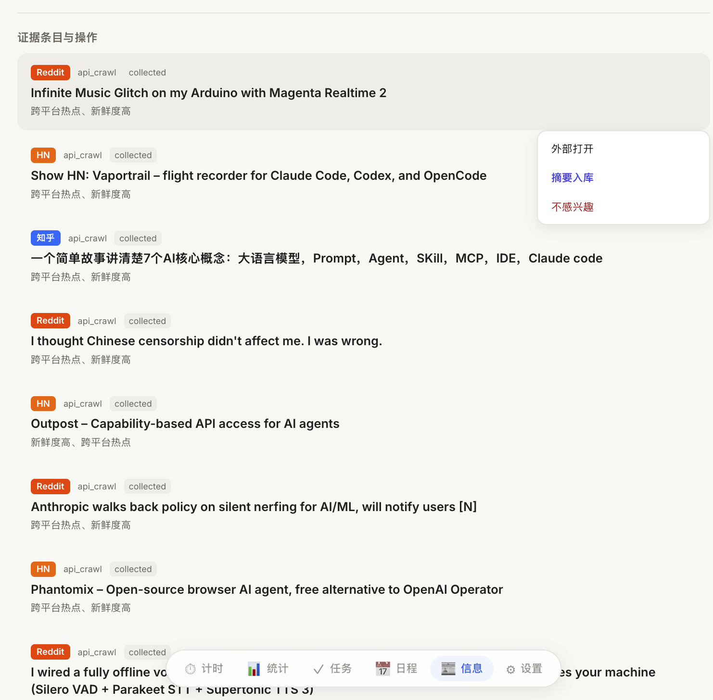

# DiGist — AI 信息消化引擎

多平台信息采集 → SQLite 存储 → 融合报告 → 自进化调度的 AI 信息管道。

Polarisor 生态的**信息输入层**，为 KnowLever、LLMWiki、Lobster 提供预处理后的结构化数据。

## 页面预览

> 截图位于 `screenshots/`，均为 DiGist 信息页实拍。





## 快速开始

```bash
npm install
npm run build

# 单次爬取（bin/digist 自动对齐 Node 22）
bash bin/digist scrape arxiv "large language model"
bash bin/digist scrape hackernews ""
bash bin/digist scrape github "trending"

# 启动 HTTP API（PolarProcess + PolarPort 管理，推荐）
bash Start/start.sh              # 启动 digist-api（端口由 PolarPort 分配，默认 3800）
bash Start/start.sh status         # 查看状态
bash Start/start.sh restart        # 重启

# 或通过 PolarProcess API 重启（端口见 PolarPort service_name=polar-process）
curl -X POST http://127.0.0.1:8010/api/services/digist/restart

# 本地调试（不经 PolarProcess）
npm run digist-api

# 启动完整引擎 (调度器 + 进化 + 报告)
npm run start

# 生成每日摘要 (需要 PolarPrivate 代理)
npm run summarize
```

## 架构

```
采集层 (Scrapers)              存储层            消化层                 输出
├── arxiv      (API 直连)  →                  ├── density-evaluator  ├── fusion reports
├── hackernews (API 直连)  →   SQLite          ├── knowledge-graph    ├── daily digest
├── reddit     (API 直连)  →   (FTS5)          ├── semantic-linker    ├── wiki compile
├── github     (HTTP)      →                  └── conflict-detector  └── HTTP API (:3800)
├── twitter    (Safari)   →
├── xiaohongshu(Safari)   →    进化层
├── zhihu      (Safari)   →    ├── strategy-optimizer
├── bilibili   (Safari)   →    ├── source-discoverer
└── bloomberg  (Safari)   →    └── pipeline-tuner
```

## 平台分类

| 类型 | 平台 | 依赖 |
|------|------|------|
| API 直连 | arxiv, hackernews, github | 无，始终可用 |
| RSS | reddit, wechat | 无需认证，后台静默 |
| Safari (AppleScript) | twitter, xiaohongshu, zhihu, bilibili, bloomberg | macOS + Safari 开启 "Allow JS from Apple Events" |
| 桥接 | glass | 需要 Glass 屏幕监控运行 |

> Safari 抓取复用你已登录的 Safari 会话，完全后台执行，不弹窗不抢焦点。
> Reddit 于 2025 Q4 封杀了 JSON API；现走 RSS feed（标题+正文+作者，无互动数据）。

### 高风险平台时间窗

`twitter`（X）和 `zhihu` 通过 Safari 抓取时，强制限制在 **凌晨 01:00–07:00**（`Asia/Shanghai`）执行，以降低账号封禁风险。两个平台不在上述时段时会被策略跳过。

可通过环境变量覆盖：

| 变量 | 默认值 | 说明 |
|------|--------|------|
| `DIGIST_RISK_WINDOW_START_HOUR` | `1` | 开始小时（24h 制） |
| `DIGIST_RISK_WINDOW_END_HOUR` | `7` | 结束小时（24h 制） |
| `DIGIST_POLICY_TZ` | `Asia/Shanghai` | 时区 |

## 定时爬取

通过 launchd 驱动 `scripts/daily-digest.sh`，每天 06:00-23:00 每 3 小时运行。
API 直连平台不受 Safari 登录态影响，始终执行。

```bash
# 安装 launchd 任务
cp scripts/com.digist.daily-digest.plist ~/Library/LaunchAgents/
launchctl load ~/Library/LaunchAgents/com.digist.daily-digest.plist
```

## 目录结构

```
src/
├── api/           HTTP API server (port 4880) + crawl-api
├── scrapers/      各平台爬虫
├── scheduler/     cron 调度器
├── storage/       SQLite 存储 + migrations
├── digestion/     密度评估、上下文压缩、知识索引
├── fusion/        知识图谱、语义链接、冲突检测、报告生成
├── evolution/     策略优化、信源发现、管道调参
├── normalizer/    数据标准化 + 去重
├── preprocess/    PDF/音频/图片预处理 (部分集成)
├── wiki/          Wiki 编译管道
└── engine.ts      主引擎入口

web/               Next.js 可视化面板
scripts/           daily-digest.sh, summarize-daily.ts
data/              运行时数据 (SQLite, 日志, 报告)
```

## 跨项目集成

| 项目 | 集成方式 | 状态 |
|------|---------|------|
| SOTAgent | HTTP API (:4880) + SQLite 直读 + 进程管理 | ✅ 已接入 |
| KnowLever | digest-bridge (SQLite) + digest-sync | ⚠️ 桥接已建，自动同步待完善 |
| LLMWiki | normalizer 数据导入 | ⚠️ 基础路径配置 |
| PolarPrivate | LLM 代理 (:12790) | ✅ 已接入 |

## 环境变量

| 变量 | 默认值 | 说明 |
|------|--------|------|
| `DIGIST_DB` | `./data/digist.sqlite` | SQLite 路径 |
| `PORT` | `4880` | API 端口（PolarPort SSOT） |
| `POLARPRIVATE_URL` | `http://127.0.0.1:12790` | PolarPrivate 代理地址 |
| `SAFARI_MIN_INTERVAL_MS` | `10000` | Safari 平台最小调用间隔 (ms) |
