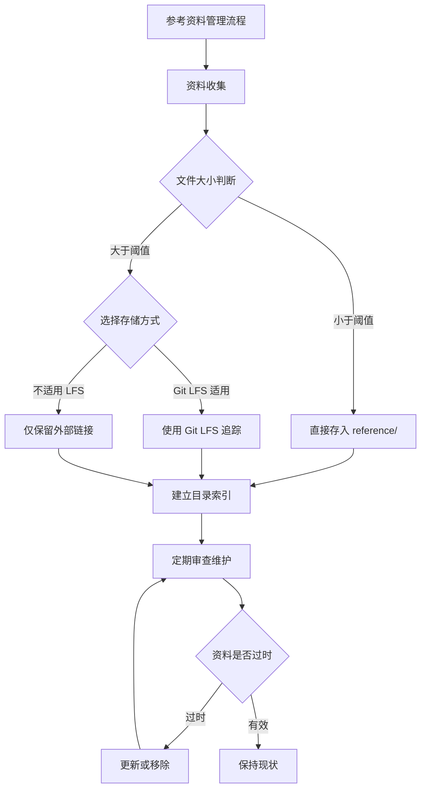
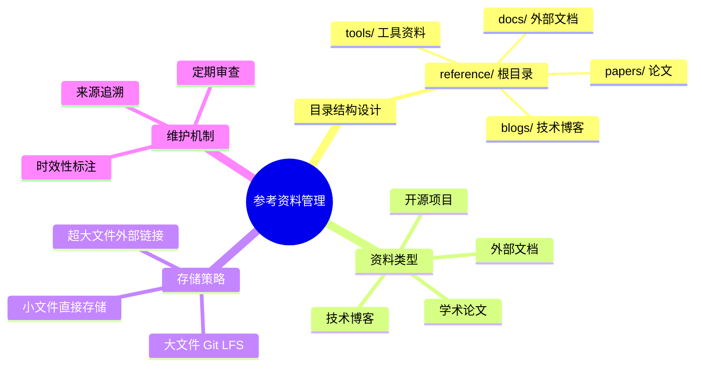

## 定义

参考资料管理（Reference Management）是指在软件项目中系统化地收集、组织、存储和维护外部技术资料的方法论和实践。这些外部资料包括但不限于：开源项目代码、学术论文、技术博客、第三方文档、API 规范、架构设计文档等。

从概念边界来看，参考资料管理与内部文档管理存在本质区别：内部文档是由项目团队自身产出和维护的内容，反映的是项目特定的技术决策和实现细节；而参考资料则是项目团队从外部引入的「只读」材料，用于辅助理解技术方案、学习相关背景知识或作为技术选型的参考依据。

参考资料管理的核心目标不是创造新知识，而是建立一个高效的知识检索和复用系统，使得团队成员能够快速找到所需的参考资料，避免重复搜索，同时确保这些资料的可追溯性和时效性。

## 解决什么问题

在软件开发实践中，参考资料管理不善会带来一系列问题：

### 知识碎片化

当团队成员各自在自己的本地环境或即时通讯工具中保存参考资料时，知识的载体高度分散。一个新加入的成员想要了解项目涉及的技术栈，往往需要向多个同事分别询问，效率低下。更糟糕的是，当某位成员离职或设备更换时，这些散落的知识载体可能随之消失，造成知识断层。

### 重复资源浪费

没有统一的参考资料库时，团队成员可能各自下载相同的 PDF 论文、视频教程或开源工具包，造成存储空间的浪费。在网络带宽有限的环境下，重复下载更是影响工作效率。此外，当某份资料需要更新时，难以确保所有成员都能及时获取最新版本。

### 技术决策缺乏依据

在架构选型或技术方案讨论中，团队需要参考大量的外部资料。如果这些资料没有系统化管理，讨论时可能「凭记忆」引用关键结论，难以验证准确性。长期下来，可能导致团队在技术路线上缺乏清晰的决策依据，增加技术债务的风险。

### 新成员上手困难

项目交接时，新成员往往需要花费大量时间来理解项目涉及的技术背景。如果缺乏集中的参考资料库，他们需要在互联网上四处搜索相关资料，学习曲线陡峭，进度缓慢。

## 工作原理

### 核心原则

参考资料管理遵循以下核心原则：

**物理分离原则**：将参考资料与项目源代码在目录结构层面进行分离，形成独立的存储区域。这一原则源于软件工程中的「关注点分离」思想，强调不同性质的文件应当物理隔离管理，避免混淆。

**只读性原则**：参考资料一旦存入管理系统，应当被视为「快照」而非「工作副本」。如果需要基于某份参考资料进行修改或衍生，应当复制到项目的相应目录中，并在参考资料库中保持原始版本的引用。

**可追溯性原则**：每份参考资料应当包含清晰的来源信息，包括原始 URL、作者、发布时间、版本号等，便于团队成员验证资料的可信度和时效性。

**分类组织原则**：根据资料的类型、主题或用途进行分类，建立清晰的目录层级结构，便于检索和浏览。

### 目录结构设计

典型的参考资料目录结构可以采用以下模式：

```
project/
├── src/                 # 项目源代码
├── docs/                # 内部文档
├── reference/           # 参考资料库（本文讨论的核心）
│   ├── papers/          # 学术论文
│   │   ├── architecture/
│   │   └── algorithms/
│   ├── blogs/           # 技术博客
│   ├── docs/            # 外部文档（第三方手册、API文档）
│   ├── opensource/      # 开源项目引用
│   └── videos/          # 视频教程
├── tests/               # 测试代码
├── configs/             # 配置文件
└── README.md            # 项目说明
```

### 版本控制集成

将参考资料纳入 Git 版本控制体系，可以获得以下好处：

1. **变更历史可追溯**：任何资料的增删改都有完整的提交记录
2. **团队同步**：通过 push/pull 操作，团队成员可以同步获取最新的资料状态
3. **分支管理**：可以建立专门的分支来管理资料更新，审阅后再合并

但是，对于大型二进制文件（如 PDF 合集、视频等），直接提交到 Git 仓库会导致仓库体积膨胀，此时应当采用 Git LFS 或外部链接的方式处理。

### 生命周期管理

参考资料从引入到淘汰，经历以下阶段：

```
引入 → 审查 → 存储 → 使用 → 维护 → 归档/删除
  │       │       │       │       │
  └───────┴───────┴───────┴───────┴────→ 完整生命周期
```

**引入阶段**：团队成员发现并认定某份资料有价值，决定将其纳入参考资料库。

**审查阶段**：评估资料的质量、可信度、版权合规性，以及与项目的相关性。

**存储阶段**：按照分类体系将资料放入适当位置，补充来源信息。

**使用阶段**：团队成员在开发、调试、学习过程中查阅参考资料。

**维护阶段**：定期检查资料的有效性，更新过时链接，补充新版本。

**归档/删除阶段**：当资料已经严重过时或与项目不再相关时，将其移动到归档目录或删除。

## 关键方法

### 方法一：目录分类法

根据资料的客观属性（类型、格式、来源）进行分类是最常见的方法。

**按类型分类**：
- papers/ — 学术论文（PDF 为主）
- blogs/ — 技术博客文章（Markdown 或 HTML）
- docs/ — 官方文档或手册（PDF、HTML）
- source/ — 开源代码仓库（克隆的 Git 仓库）
- videos/ — 视频教程

**按主题分类**：
- architecture/ — 架构设计相关
- algorithms/ — 算法和数据结构
- security/ — 安全相关
- performance/ — 性能优化
- testing/ — 测试方法

### 方法二：索引文件法

在参考资料库的根目录维护一个索引文件（如 REFERENCE.md），记录所有重要资料的清单和简介。

```markdown
# 项目参考资料索引

## 架构设计
- [《Designing Data-Intensive Applications》](papers/architecture/ddia-summary.pdf)
  - 作者：Martin Kleppmann
  - 用途：分布式系统设计原则参考

## 算法实现
- [Bloom Filter 原理与实现](blogs/bloom-filter.md)
  - 来源：某技术博客
  - 相关代码：opensource/bloom-filter/
```

### 方法三：元数据标签法

为每份资料添加结构化的元数据标签，便于后续检索和筛选。常见标签包括：

- 技术领域（frontend、backend、devops、ml）
- 难度级别（beginner、intermediate、advanced）
- 时效性（current、outdated、 evergreen）
- 资料格式（pdf、video、code、article）

## 典型应用

### 应用场景一：新项目初始化时的参考资料库搭建

在某后端微服务项目的初始化阶段，团队需要确定技术栈。架构师决定引入 Spring Cloud 和 Kubernetes 作为核心技术方案。

**操作步骤**：

1. 创建项目目录结构，包括 reference/ 子目录
2. 克隆 Spring Cloud 官方文档和 Kubernetes 官方文档的静态版本到 reference/docs/
3. 从 arXiv 下载 3 篇关于微服务架构的经典论文到 reference/papers/
4. 整理一份 README.md 作为参考资料索引

```
reference/
├── README.md
├── docs/
│   ├── spring-cloud-docs/
│   └── kubernetes-docs/
├── papers/
│   ├── microservices-survey-2017.pdf
│   └── saga-pattern-2019.pdf
└── blogs/
    └── microservices-best-practices.md
```

**效果**：新成员加入后，可以通过阅读 reference/README.md 快速了解项目的技术背景，也可以直接查阅原始文档深入学习。

### 应用场景二：技术选型决策中的参考资料管理

团队需要进行数据库选型，候选方案包括 PostgreSQL、MongoDB 和 Redis。

**操作步骤**：

1. 在 reference/ 下建立选型相关的临时目录 reference/dbs-evaluation/
2. 收集各数据库的官方文档、白皮书、性能对比报告
3. 整理一份选型对比表，包含关键指标（吞吐量、延迟、扩展性、成本）
4. 将决策结论记录在项目的 architecture decision records 中，并保留参考资料链接

**效果**：选型决策有完整的参考资料支撑，后续审计或复盘时可以回溯依据。

## 与其他概念的对比

### 参考资料管理 vs 内部文档管理

| 维度 | 参考资料管理 | 内部文档管理 |
|------|------------|------------|
| 内容来源 | 外部引入 | 内部产出 |
| 维护主体 | 团队共同维护 | 文档负责人维护 |
| 更新频率 | 相对稳定（快照式） | 随项目迭代更新 |
| 存放位置 | reference/ | docs/ 或 wiki/ |
| 版本控制 | 通常记录原始版本 | 与项目版本同步 |

两者的核心区别在于「谁创作、谁维护」。参考资料是「拿来主义」，团队是使用者而非作者；内部文档是「自己创作」，团队是作者和维护者。

### 参考资料管理 vs 知识管理系统

知识管理系统（如 Notion、Confluence、Obsidian）侧重于知识的加工、关联和检索，提供更丰富的编辑和协作功能。参考资料管理则更轻量，通常只是原始资料的简单组织和存放。

在实际项目中，两者可以结合使用：参考资料管理提供原始资料的集中存储，知识管理系统在此基础上进行二次加工，建立知识网络和检索入口。

## 常见误区

### 误区一：把所有资料都塞进去

参考资料库不是「数字仓库」，不是越多越好。应当有所取舍，只保留与项目真正相关的、高质量的资料。过量的参考资料会增加维护负担，用户也难以从中筛选出有价值的内容。

**正确做法**：建立收录标准，定期清理。只保留：当前项目直接引用的、作为技术选型依据的、高质量值得学习的资料。

### 误区二：忽视资料时效性

技术领域的资料更新速度快，一年前的最佳实践可能已经过时。如果不建立更新机制，参考资料库会逐渐成为「技术坟墓」。

**正确做法**：定期（每季度或每版本）审查资料有效性，更新链接或添加「时效性」标签。

### 误区三：与内部文档混淆

有些团队将参考资料和内部文档混放在同一个目录，认为「都是文档，放哪里无所谓」。这会导致边界模糊，增加理解和维护的复杂度。

**正确做法**：明确区分边界。内部文档反映项目自身情况（决策、流程、实现），存放在 docs/ 或 wiki/；外部参考资料作为学习参考，存放在 reference/。

### 误区四：大文件直接提交 Git

将大型 PDF 合集、视频文件直接 git add 到仓库，会导致仓库体积急剧膨胀，clone 和 pull 操作变慢。

**正确做法**：对于超过一定阈值（如 10MB）的文件，使用 Git LFS 追踪，或仅在参考资料库中保留外部链接而非文件本身。

## 关联知识

### 相关概念

- [[concept-git-lfs]] — Git 大文件存储技术，是管理大型参考资料的重要工具
- [[concept-documentation-standards]] — 文档规范，通常与参考资料管理共同构成项目文档体系
- [[concept-knowledge-management]] — 知识管理的更广泛领域，参考资料管理是其子集
- [[concept-version-control]] — 版本控制，与参考资料管理紧密集成

### 扩展阅读

对于希望深入了解项目文档管理的读者，建议进一步了解：

- **项目文档结构最佳实践**：如 JSDoc、Docstring 等代码文档生成工具
- **架构决策记录（ADR）**：记录技术决策及其依据的方法
- **GitHub Wiki 与 GitBook**：适合团队协作的文档托管方案

## 待探讨

在实际应用中，参考资料管理仍有一些问题值得团队根据自身情况决策：

### 问题一：参考资料库是否需要纳入 Code Review？

当团队成员向 reference/ 添加新资料时，是否需要像代码变更一样经过 Review？一方面，Review 可以确保资料质量；另一方面，对于参考资料这种「只读快照」，严格的 Review 流程可能过于繁琐。团队需要在效率和把控之间找到平衡。

### 问题二：如何处理有版权限制的资料？

某些论文或书籍有明确的版权限制，禁止自由分发或再传播。在将这类资料存入参考资料库时，需要确保版权合规。建议的做法是：只存放公开可获取的资料，对于受版权保护的内容，仅保留链接并在索引中注明来源和访问方式。

### 问题三：参考资料库与内部知识库如何协同？

很多团队已经建立了 Confluence、Notion 等内部知识库。在这种情况下，参考资料库和知识库应当如何分工？一种思路是：参考资料库作为「原始资料库」，知识库作为「知识加工层」，团队在参考资料的基础上提炼、整合形成内部知识。

---

**来源**：src-20260502-readme

<div align="right" style="opacity: 0.5; font-size: 0.8em;">✨ <i>Compiled by MiniMax-M2.7-highspeed</i></div>


## 图示



> 参考资料管理完整流程图


## 图示



> 参考资料管理要素思维导图
